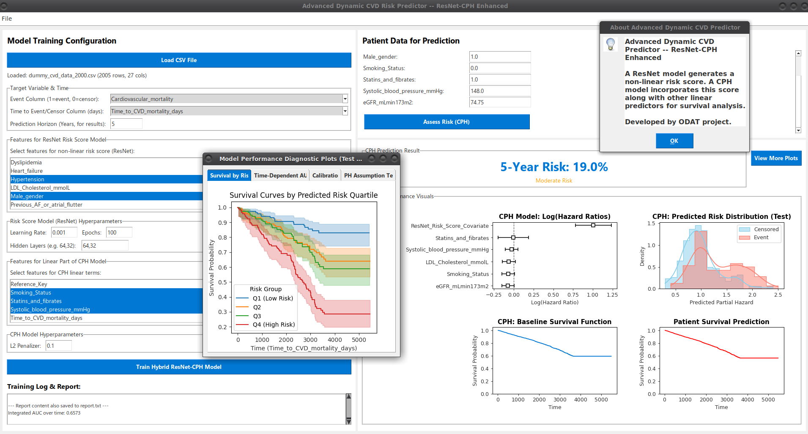

# Tool 16

This GUI-based application uses Residual Network (ResNet) deep learning model to generate nonlinear risk score and feed them back to Cox regression along with other linear predictor for advance survival analysis.  

## Description

[Visit odat.info](https://odat.info)

## Screenshot

